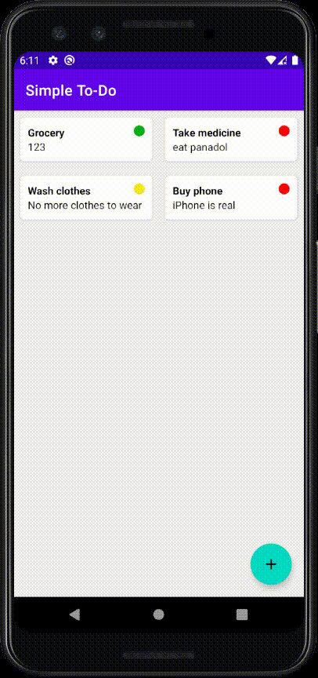

# Simple-ToDo
- **MVVM architecture** (ViewModel, Repository)
- Single Activity Architecture with **Navigation Component**
- Dependency Injection with **Dagger-Hilt**
- Room Database
- LiveData
- ListAdapter with DiffUtils

# Features
- Add/delete To-do 
- Click to view To-do in a dialog
- Able to mark To-do as done
- More features to come
